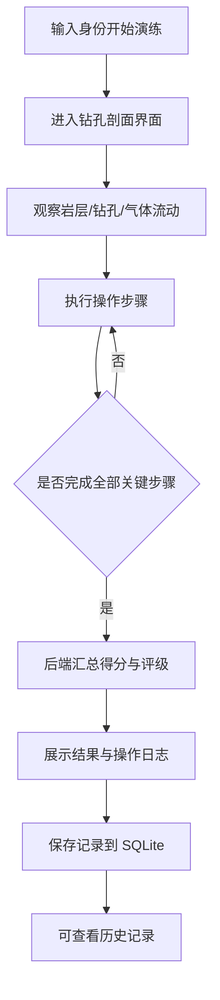

# 废旧矿井地质钻孔安全演练系统 — 产品需求文档

## 1. 产品概述

本系统是一个面向废旧矿井地质钻孔安全处置的网页化演练平台，以 2D 游戏方式模拟井下钻孔剖面，演练人员通过封堵钻孔、注入水泥等操作完成钻孔安全处置流程，系统实时记录每一步操作并给出得分，用于培训与考核。

- 主要目的/解决的问题：在无实井风险条件下，低成本演练钻孔封堵与有害气体治理的标准操作流程
- 目标用户：矿井安全培训学员、演练考核管理人员
- 价值：规范操作流程、量化演练考核、可复盘回溯

## 2. 核心功能

### 2.1 用户角色

| 角色 | 进入方式 | 核心权限 |
|------|----------|----------|
| 演练人员 | 输入工号/姓名开始演练 | 执行钻孔处置操作、查看本次得分与操作日志 |
| 考核管理员 | 同入口（权限区分可选） | 查看历史演练记录与得分排名 |

### 2.2 功能模块

1. **演练主界面**：钻孔剖面游戏画布（Pixi.js）、岩层与钻孔管道、气体流动动画、操作控制面板、实时状态/得分面板、操作日志
2. **历史记录界面**：历次演练记录列表、单条得分详情与操作序列

### 2.3 页面详情

| 页面 | 模块 | 功能说明 |
|------|------|----------|
| 演练主界面 | 钻孔剖面画布 | Pixi.js 渲染多层岩层、钢质钻孔套管、气体向上流动粒子动画、水泥向下灌注填充动画 |
| 演练主界面 | 操作控制面板 | 选择钻孔、检测气体、安装套管、封堵钻孔、注入水泥、验证封堵、开始/重置演练 |
| 演练主界面 | 状态与得分面板 | 实时气体压力、封堵进度、当前得分、操作计时、安全评级徽章 |
| 演练主界面 | 操作日志 | 时间线展示每步操作、正确性标记与系统反馈 |
| 历史记录界面 | 记录列表 | 表格展示历次演练人员、得分、用时、操作步数 |
| 历史记录界面 | 得分详情 | 单条记录的操作序列与扣分/加分明细 |

## 3. 核心流程

演练人员输入身份后进入演练界面，观察钻孔剖面与气体流动，依次执行标准操作，每步由后端记录并实时计分，全部完成后给出总分与评级并入库，可随时查看历史记录。

## 4. 用户界面设计

### 4.1 设计风格

- 风格：工业控制台 / 地质蓝图风。深色岩层底色，土黄、赭石、板岩、煤黑等岩层色，危险琥珀 + 气体青绿作点缀
- 配色：主底色 板岩深灰 `#14181d`；岩层赭 `#b07d3b`；琥珀警示 `#f5a524`；气体青 `#2dd4bf`；水泥灰白 `#cbd5e1`
- 按钮：方形/微圆角、有按压立体感；危险操作（封堵/注入）使用琥珀描边
- 字体：标题 Big Shoulders Display（工业压缩体），正文 IBM Plex Sans，数据读数 IBM Plex Mono
- 布局：左侧游戏画布 + 右侧控制/状态面板，顶部状态栏，底部操作日志；桌面优先

### 4.2 页面设计概览

| 页面 | 模块 | UI 元素 |
|------|------|--------|
| 演练主界面 | 钻孔剖面画布 | 深色背景、岩层色带、钢质钻孔套管、气体粒子向上流动、水泥向下灌注填充 |
| 演练主界面 | 控制面板 | 钻孔选择、操作按钮组、计时/重置 |
| 演练主界面 | 状态得分面板 | 压力表、封堵进度条、得分数字、评级徽章 |
| 演练主界面 | 操作日志 | 时间线条目、正确/错误标记、系统反馈文本 |
| 历史记录界面 | 记录列表 | 表格、得分条形、操作步数 |
| 历史记录界面 | 得分详情 | 抽屉式详情、操作序列、加分/扣分明细 |

### 4.3 响应式

桌面优先（演练需大屏观察钻孔剖面）；平板自适应缩放画布；移动端可查看历史记录但不主推演练操作。

### 4.4 2D 场景指引（Pixi.js）

- 环境：井下剖面，自上而下 表土 → 砂岩 → 页岩 → 煤层 → 石灰岩，整体暗光、岩层纹理
- 钻孔管道：垂直钢质套管，井口位于顶部，可见管壁与节段
- 气体流动：自煤层/钻孔底部向上的青绿色粒子流，封堵成功后逐步衰减至消失
- 水泥注入：自井口向下灌注的灰白流体，逐步填充钻孔下部
- 交互：点击钻孔进行选择，控制面板按钮触发操作，画布即时呈现动画反馈与状态变化
