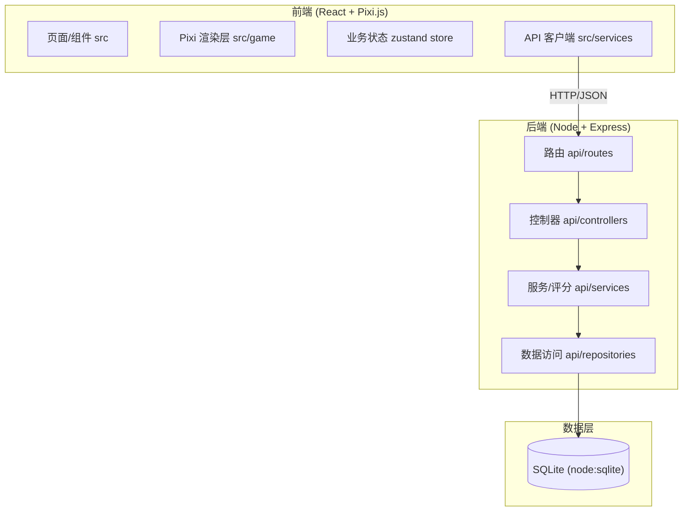
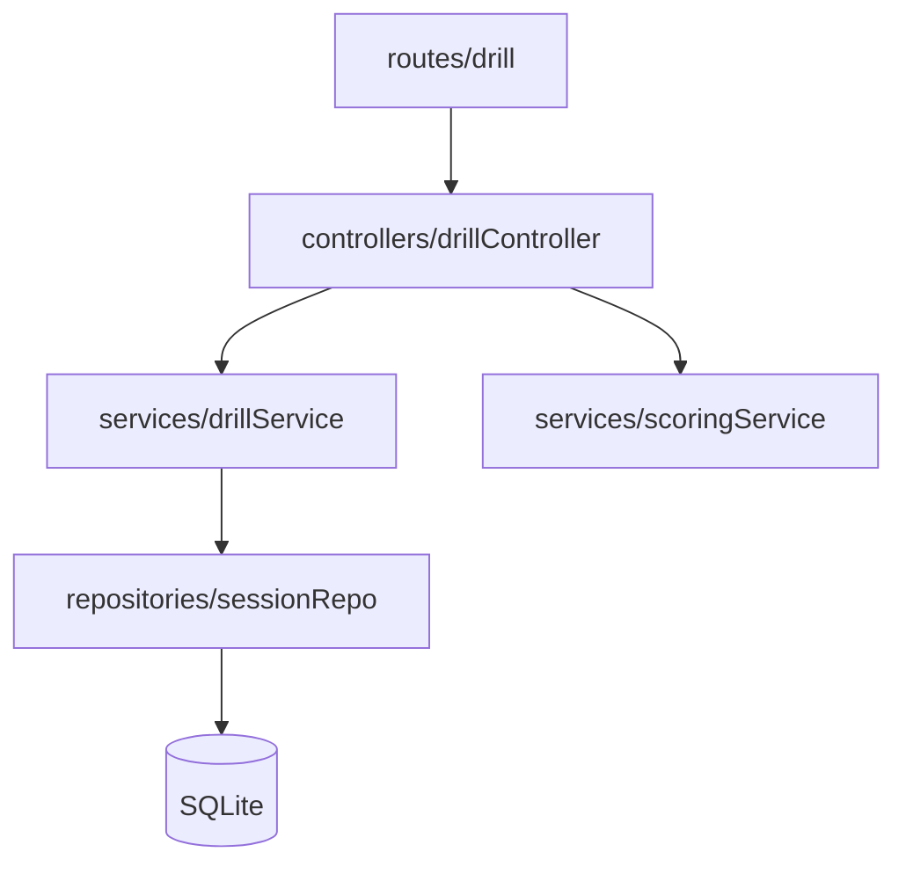
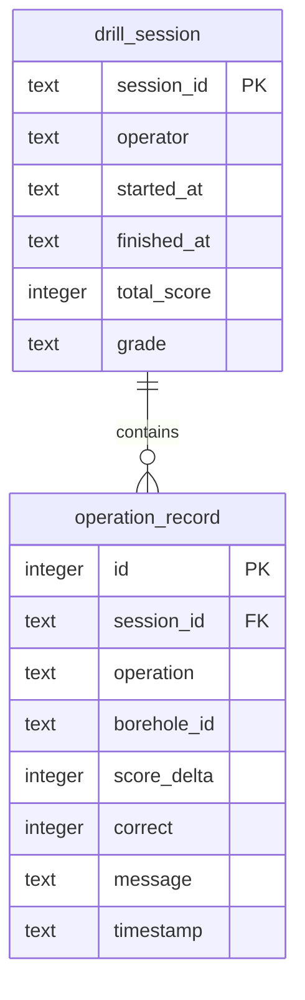

# 废旧矿井地质钻孔安全演练系统 — 技术架构文档

## 1. 架构设计



## 2. 技术说明

- 前端：React 18 + TypeScript + Tailwind CSS + Zustand + react-router-dom
- 游戏引擎：PixiJS v8（2D 渲染）
- 初始化工具：vite-init（react-express-ts 模板）
- 后端：Express 4 + TypeScript（ESM 模块）
- 数据库：SQLite（Node 内置 `node:sqlite` 模块，`DatabaseSync` 同步 API，无需原生编译，持久化到 `.data/drill.db` 文件）
- 共享类型：`shared/` 目录存放前后端共用类型

## 3. 路由定义

| 路由 | 用途 |
|------|------|
| `/` | 演练主界面（钻孔剖面游戏 + 控制面板 + 状态/日志） |
| `/records` | 历史演练记录列表与得分详情 |

## 4. API 定义

```ts
// shared/types.ts
export type OperationType =
  | 'detect_gas'      // 检测气体
  | 'install_casing'  // 安装套管
  | 'plug'            // 封堵钻孔
  | 'inject_cement'   // 注入水泥
  | 'verify_seal';    // 验证封堵

export interface OperationRecord {
  id: number;
  sessionId: string;
  operation: OperationType;
  boreholeId: string;
  scoreDelta: number;
  correct: boolean;
  message: string;
  timestamp: string;
}

export interface DrillSession {
  sessionId: string;
  operator: string;
  startedAt: string;
  finishedAt: string | null;
  totalScore: number;
  grade: string;
}

export interface OperationResponse {
  ok: boolean;
  scoreDelta: number;
  correct: boolean;
  message: string;
  totalScore: number;
  sealed: boolean;
}
```

| 方法 | 路径 | 说明 |
|------|------|------|
| POST | `/api/sessions` | 创建演练会话（传入操作人员），返回 sessionId |
| POST | `/api/sessions/:id/operations` | 提交一步操作，返回该步得分增量、正确性与累计得分 |
| POST | `/api/sessions/:id/finish` | 结束演练，汇总总分与评级 |
| GET | `/api/sessions/:id` | 获取会话详情与操作序列 |
| GET | `/api/sessions` | 历史记录列表 |

## 5. 服务端架构图



## 6. 数据模型

### 6.1 数据模型定义



### 6.2 数据定义语言

```sql
CREATE TABLE IF NOT EXISTS drill_session (
  session_id   TEXT PRIMARY KEY,
  operator     TEXT NOT NULL,
  started_at   TEXT NOT NULL,
  finished_at  TEXT,
  total_score  INTEGER NOT NULL DEFAULT 0,
  grade        TEXT
);

CREATE TABLE IF NOT EXISTS operation_record (
  id           INTEGER PRIMARY KEY AUTOINCREMENT,
  session_id   TEXT NOT NULL,
  operation    TEXT NOT NULL,
  borehole_id  TEXT NOT NULL,
  score_delta  INTEGER NOT NULL,
  correct      INTEGER NOT NULL,
  message      TEXT NOT NULL,
  timestamp    TEXT NOT NULL,
  FOREIGN KEY (session_id) REFERENCES drill_session(session_id)
);

CREATE INDEX IF NOT EXISTS idx_operation_session ON operation_record(session_id);
```

## 7. 关键设计：渲染逻辑与业务逻辑分离

- **渲染层（`src/game/`）**：仅负责 Pixi.js 画布渲染（岩层、钻孔套管、气体粒子动画、水泥填充动画）。它接收一个纯数据状态对象（`DrillSceneState`）进行重绘，不直接调用任何后端 API。
- **业务层（`src/store/` + `src/services/`）**：负责演练流程编排、调用后端 API、维护状态、计分协调，通过 zustand store 暴露给 UI。
- **数据流向**：用户操作 → store（业务层）→ 调用后端 → 后端计分并入库 → 返回新状态 → store 更新 → 渲染层订阅状态并重绘。渲染层与业务层通过纯数据接口解耦，便于单独测试与替换。
